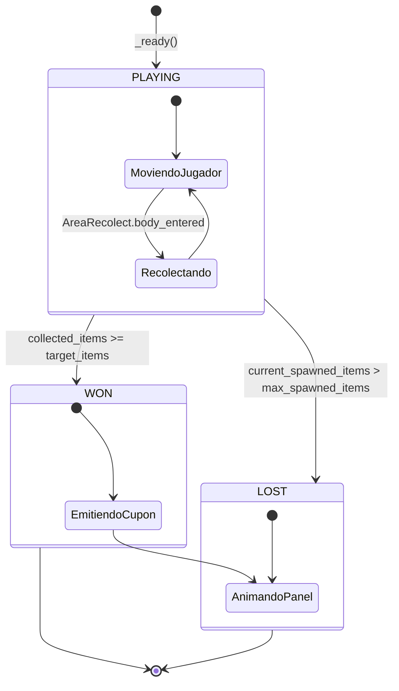

# Diagrama de Estados — CouponGame "Taller de Repuestos" (Laboratorio 6)

Componente: `src/scenes/gamification/coupon_game.gd`

## Tabla de transiciones

| Desde | Hacia | Evento / condición | ¿Permitida? |
|---|---|---|---|
| `PLAYING` | `WON` | `collected_items >= target_items` | ✅ |
| `PLAYING` | `LOST` | `current_spawned_items > max_spawned_items` | ✅ |
| `WON` | cualquiera | — | ❌ (estado terminal) |
| `LOST` | cualquiera | — | ❌ (estado terminal) |

`change_state()` es la única función que modifica `current_state`.
